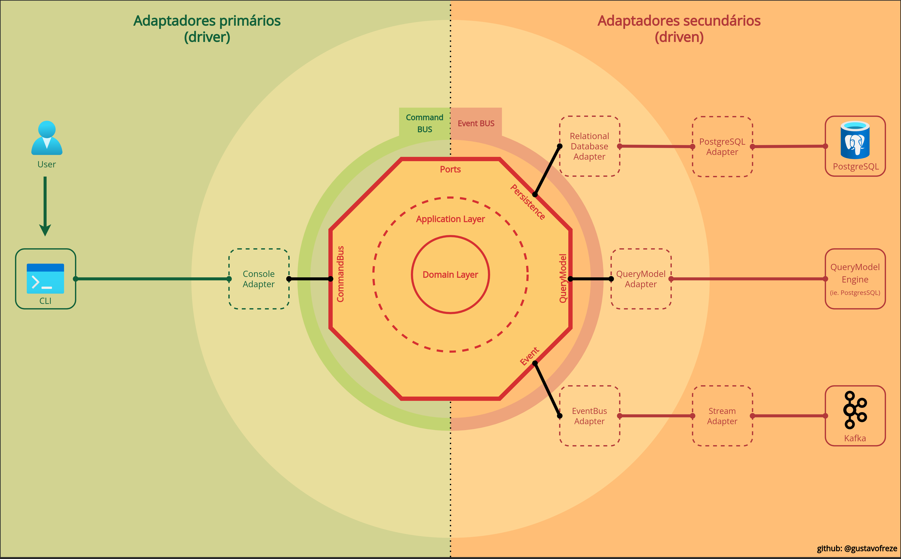
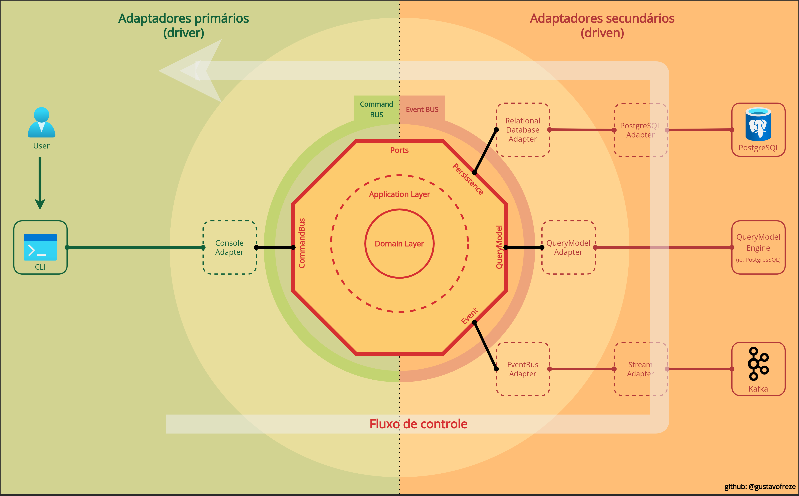
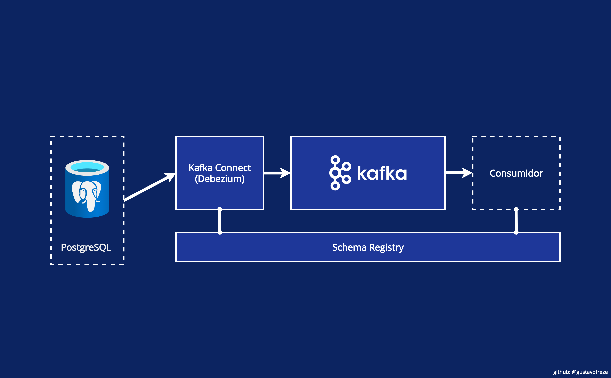
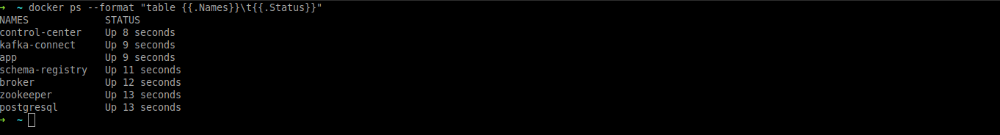
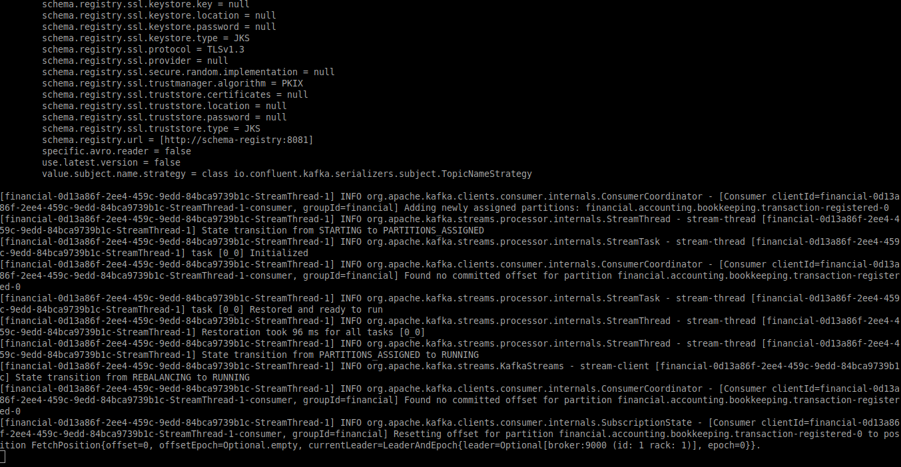
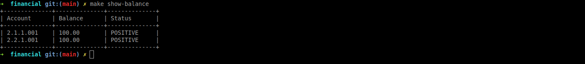
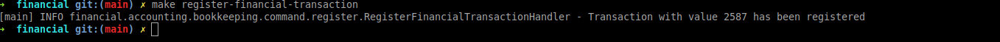
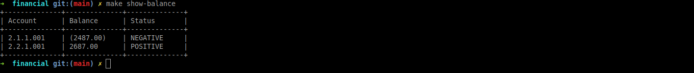
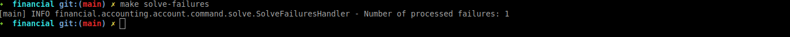
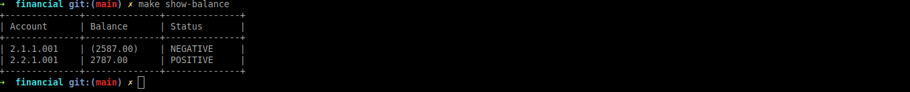

# Financial

[](LICENSE)

* [Overview](#overview)
    - [Domínio](#domain)
    - [Arquitetura](#architecture)
    - [Organização da aplicação](#organization)
    - [Casos de uso](#use_cases)
* [Instalação](#installation)
    - [Repositório](#repository)
    - [Configuração](#settings)
* [Roadmap](#roadmap)
    - [Verificando o ambiente](#checking)
    - [Executando os casos de uso](#run_use_cases)
* [Testes](#tests)
* [Úteis](#useful)

<div id="overview"></div> 

## Overview

A ideia deste projeto é aplicar o conteúdo estudado sobre **Clean Architecture**, **Hexagonal Architecture**,
**Domain-Driven Design**, **Event Sourcing**, **CQRS** e **Kafka**.

<div id='domain'></div> 

### Domínio

O domínio da aplicação é **financial**, que possui um subdomínio **accounting**. Dentro do subdomínio, temos dois
contextos, **account** e **bookkeeping**.

<!--suppress HtmlDeprecatedAttribute -->
<p align="center">
    
    <br />
    <tl>Representação do domínio.</tl>
</p>

#### Accounting

O **Accounting** (contabilidade) é o processo de registro de transações financeiras pertencentes a uma empresa.

**Account**

O contexto de account nada mais é do que uma conta contábil, que contém contas nas quais as informações sobre as
transações de débitos e créditos são classificadas e resumidas.

**Bookkeeping**

O contexto de bookkeeping é o registro das transações financeiras, e envolve a preparação de documentos de origem para
todas as transações, operações e outros eventos de uma empresa. As transações incluem compras, vendas, recebimentos e
pagamentos por uma pessoa individual ou uma organização.


<div id='architecture'></div> 

### Arquitetura

A arquitetura da aplicação está dividida em alguns pilares, os quais delimitam os contextos.

<!--suppress HtmlDeprecatedAttribute -->
<p align="center">
    
    <br />
    <tl>Arquitetura do Financial.</tl>
</p>


<!--suppress HtmlDeprecatedAttribute -->
<p align="center">
    
    <br />
    <tl>Fluxo da aplicação.</tl>
</p>

- **Command**

  Um comando é uma ordem para execução de algum caso de uso de negócio, eles geralmente resultam em eventos sendo
  emitidos.


- **Core**

  É o núcleo da aplicação. Os objetos desta camada contém a lógica para manipular os casos de uso, que são específicos
  do próprio domínio. O core é independente dos processos de negócio que acionam essa lógica, são independentes e
  desconhecem completamente outras camadas.


- **Driven**

  No driven estão os adaptadores de acionamento, os quais implementam as interfaces de saída da aplicação. Isso permite
  que o núcleo da aplicação exponha funcionalidades para o exterior.


- **Driver**

  No driver estão os adaptadores primários que envolvem uma porta e a usam para informar ao core o que fazer. Eles
  traduzem tudo o que vem de um mecanismo de entrega em uma chamada de método no core.


- **Query**

  Implementações das recuperações dos modelos de leitura.

<div id="organization"></div> 

### Organização da aplicação

De forma geral, a aplicação está separada em quatro módulos:

```
application
┣ 📂account
┣ 📂bookkeeping
┣ 📂shared
┗ 📂starter
```

**Account**: Possui a lógica/regra de negócio do contexto de account.

**Bookkeeping**: Possui a lógica/regra de negócio do contexto de bookkeeping.

**Shared**: Possui implementações e interfaces comuns, que não detém lógica/regra de negócio. O conteúdo desse módulo
pode ser convertido em várias bibliotecas.

**Starter**: Possui a inicialização dos componentes de plataforma usados pela aplicação, e as configurações de
dependências da aplicação.

<div id='use_cases'></div> 

### Casos de uso

**Bookkeeping**

No contexto de bookkeeping, quando uma operação contábil é registrada a partir de um comando
`RegisterFinancialTransaction`, então um evento de `TransactionRegistered` ocorre, e é registrado no
tópico `financial.accounting.bookkeeping.transaction-registered`. Apenas transações com valores maiores que **R$ 0,00**
são registradas.

O streaming dos dados é realizado usando o Kafka, onde foi utilizado o método
de [CDC](https://en.wikipedia.org/wiki/Change_data_capture), implementando uma abordagem utilizando logs.

<!--suppress HtmlDeprecatedAttribute -->
<p align="center">
    
    <br />
    <tl>Fluxo de CDC com o Kafka.</tl>
</p>

**Account**

No contexto de account, uma política reage ao evento `TransactionRegistered` emitido pelo contexto de bookkeeping, o que
resulta em um comando `AdjustBalance`, que faz a atualização dos saldos das contas.

<!--suppress HtmlDeprecatedAttribute -->
<p align="center">
    
    <br />
    <tl>Fluxo de produção e consumo do evento.</tl>
</p>

<div id='installation'></div> 

## Instalação

<div id='repository'></div> 

### Repositório

Para clonar o repositório usando a linha de comando, execute:

```bash
git clone https://github.com/gustavofreze/financial.git
```

<div id='settings'></div> 

### Configuração

Verifique se algum processo usa as portas: **2181**, **5432**, **8080**, **8081**, **8083**, **9000**, **9001**
e **9021**. Se alguma das portas descritas estiver em uso, ela deve ser “liberada”.

Para instalar e configurar o projeto, execute na raiz do projeto:

```bash
make configure
```

<div id='roadmap'></div> 

## Roadmap

<div id='checking'></div> 

### Verificando o ambiente

Para executar os casos de uso, basta estar com o ambiente docker inicializado.

Você pode conferir executando:

```bash
docker ps --format "table {{.Names}}\t{{.Status}}"
```

<!--suppress HtmlDeprecatedAttribute -->
<p align="center">
    
    <br />
    <tl>Containers inicializados.</tl>
</p>

E posteriormente verifique a aplicação executando:

```bash
docker logs -f app
```

<!--suppress HtmlDeprecatedAttribute -->
<p align="center">
    
    <br />
    <tl>Aplicação pronta para executar os casos de uso.</tl>
</p>


<div id='run_use_cases'></div> 

### Executando os casos de uso

O primeiro comando a ser executado, pertence ao contexto de account. O comando `ShowBalance` exibe o saldo de todas as
contas.

```bash
make show-balance
```

<!--suppress HtmlDeprecatedAttribute -->
<p align="center">
    
    <br />
    <tl>Saldo inicial das contas.</tl>
</p>

O segundo comando a ser executado, pertence ao contexto de bookkeeping. O comando `RegisterFinancialTransaction`
registra uma transação financeira.

```bash
make register-financial-transaction
```

<!--suppress HtmlDeprecatedAttribute -->
<p align="center">
    
    <br />
    <tl>Transação financeira registrada.</tl>
</p>

Após o comando `RegisterFinancialTransaction` ter sido executado, um evento `TransactionRegistered` é gerado, e enviado
para o tópico no Kafka, através do processo de CDC, conforme explicado anteriormente.

No contexto de account, a política irá reagir ao evento `TransactionRegistered`, o que resulta na execução do
comando `AdjustBalance`. O saldo é atualizado realizando uma operação de débito e crédito respectivamente. Mesmo se uma
conta estiver com saldo de **R$ 0,00** ou **negativo**, a operação é realizada.

Para conferir se o saldo foi atualizado, basta executar novamente o comando `ShowBalance`.

```bash
make show-balance
```

<!--suppress HtmlDeprecatedAttribute -->
<p align="center">
    
    <br />
    <tl>Saldo atualizado das contas.</tl>
</p>

Ainda no contexto de account, caso ocorra uma falha ao executar uma política, o evento desta política vai para uma fila
de solução de problemas, de forma que é possível tentar novamente sua execução.

Essa fila de solução de problemas, é uma junção dos conceitos
de [troubleshooting](https://en.wikipedia.org/wiki/Troubleshooting)
e [DLQ](https://en.wikipedia.org/wiki/Dead_letter_queue).

Para demonstrar na prática, existe um registro previamente registrado na fila troubleshooting. Para executar a política
novamente a partir da fila de troubleshooting, é necessário executar o comando `SolveFailures`.

```bash
make solve-failures
```

<!--suppress HtmlDeprecatedAttribute -->
<p align="center">
    
    <br />
    <tl>Execução da fila de troubleshooting.</tl>
</p>

Com a política de atualizar saldo executada, o saldo das contas foi mais uma vez atualizado.

Para conferir se o saldo foi atualizado, basta executar novamente o comando `ShowBalance`.

```bash
make show-balance
```

<!--suppress HtmlDeprecatedAttribute -->
<p align="center">
    
    <br />
    <tl>Saldo atualizado das contas, após a execução da política na fila de troubleshooting.</tl>
</p>

<div id="tests"></div> 

## Testes

- Executa todos os testes:

  ```bash
  make test
  ```

- Executa os testes unitários:

  ```bash
  make unit-test
  ```

- Executa os testes de integração:

  ```bash
  make integration-test
  ```

<div id="useful"></div> 

## Úteis

- Para todos os containers do projeto:

  ```bash
  make stop
  ```

- Remove todos os containers e networks criados pelo projeto:

  ```bash
  make clean
  ```

- Remove todos os containers, networks e imagens criados pelo projeto:

  ```bash
  make clean-all
  ```
